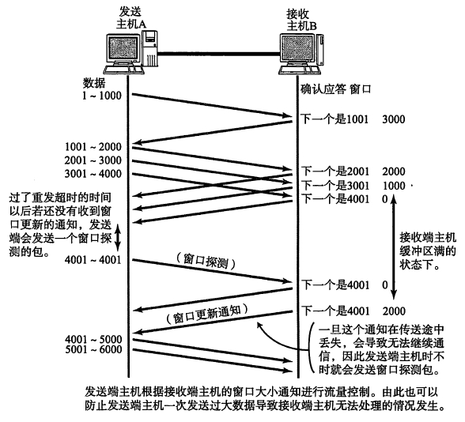

### IP的含义

IP省略的规则：

- 对于http://sample.com/，把其当成根目录处理，访问默认的文件（一般是index.html），同理，http://sample.com/apple/也一样
- 对于http://sample.com/apple，先找目录下的`apple`文件，然后把其当做目录处理

IP地址的前三部分表示网络号，最后一个8比特表示主机号

IP地址的主机号全为0表示整个子网，全为1表示向子网所有设备发送包（广播）

```
255.255.255.0 // 表示整个子网
255.255.255.1 // 表示向子网所有设备发送包
```


### 客户端和服务器连接（HTTP+TCP部分）

#### 步骤

1. 根据（调用操作系统的Socket库）域名查询IP地址
2. 创建套接字(socket)
3. 使用套接字与服务器建立连接(connect)
4. 数据（包括HTTP头部）分割成包，加TCP头部
5. 收发消息，进行数据交互
6. 服务器或客户端断开连接并删除套接字

####域名

域名使用`.`来分隔，越靠右的域名层级越高。

DNS客户端查询IP地址的过程：先查最近的DNS服务器，如果没有，查查根域的有没有，再逐层往下。

例：查询www.lab.glassroom.com的ip：

Socket库询问最近的DNS服务器 -> （DNS，以下省略）服务器不知道，服务器去查根域有没有 -> 服务器询问根域（DNS服务器，以下省略） -> 根域不知道，返回它下面com域 -> 服务器询问com域 -> com域不知道，返回它下面glassroom域 -> ... -> 服务器询问lab域 -> lab域知道，返回给服务器IP地址 -> 服务器返回给客户端域名的IP地址

DNS服务器缓存：保存的信息都有个期限，并且也能从响应中得知信息是来自缓存还是包含该域名的DNS服务器。

#### 套接字

套接字是没有实体的，每一个设备（如网卡）一个IP。

####套接字描述符与端口号的区别

服务器在启动之后监听对应的端口号，当接收到相应的端口号的时候就会启动程序进行响应。同时，为了能够处理来自多个客户端的请求，服务器在处理信息之前还会复制一份套接字的副本来接收其他客户端的请求。这样就无法通过端口号来识别与不同客户端建立的套接字，就只能通过描述符加以识别。那，怎么识别是来自不同客户端的请求呢？通过双方的IP进行识别。

也就是，通过描述符识别本机上的不同连接，或来自不同客户端的同一请求，通过端口号识别不同的请求（可能同一客户端）。

#### 连接包括哪些具体操作

告诉操作系统协议栈服务器的IP地址和端口号信息，告知服务器IP地址和端口号信息。

详细：创建一个包含开始收发信息的控制信息头部(SYN = 1)，发送到服务器；成功则响应(SYN = 1 && ACK = 1)，若失败则响应(RST = 1)，至此则成功连接（即Socket库中的`connect`操作完成。

#### MTU MSS

前者表示`IP头部 + TCP头部 + 数据`的最大可传输值，后者表示`数据`的最大可传输值

#### TCP分割包

TCP头部字段：发送方端口号、接收方端口号、序号、ACK、数据偏移量、保留、控制位（包括ACK RST SYN FIN）、窗口、校验和、紧急指针、可选字段。

#####序号和ACK

每次收发数据时，发送方发送序号（如1）和长度（如1500），接收方回送ACK号（1501)进行确认，然后发送方再进行数据发送（序号1502、长度1500）。TCP就是以这种方式确认接收方是否接受数据。

PS:出于安全考虑，序号不一定从1开始。第一次序号发送在请求连接的时候（发送SYN=1），无论是客户端还是服务器。

#####窗口

接收方有一个缓冲区用来接收数据，使得发送方能够连续的发送数据而不用等待接收方处理完数据（如下图）。

这也意味着缓冲区溢出就不能接收数据了，这里的窗口就是表示缓冲区剩余的空间大小。



#### 关闭连接

以下简称主动发起方为A，另一方为B。

A结束数据收发操作（等待一段时间后删除套接字） -> A发送FIN:1 -> B接收并发送ACK号 -> B结束数据收发操作 -> B发送FIN:1 -> A接收ACK号 -> 等待一段时间删除套接字（防止误操）


### IP协议对包的操作

####IP模块对各种类型的包收发操作都一样

####IP头部

版本号、头部长度(IHL)、服务类型(ToS)、总长度、ID号、标志(Flag)、分片偏移量、生存时间(TTL)、协议号、头部校验和、发送方IP、接收方IP、可选字段。

ID号用来区分包，同一包的不同分片ID号相同。

生存时间用来防止包被循环传输，每经过一个路由器会减1，为0时抛弃。

#### MAC头部 IP头部

前者存储下一跳的IP，后者存储目的IP。

前者不断变化，后者保持不变。

前者由制造商分配，后者基于网络拓扑。

#### MAC地址或IP地址存在的必要性

MAC地址是唯一的，IP地址是动态分配的。

若只有MAC地址，也就是DNS服务器返回的是MAC地址，则因为MAC地址之间没有关联性，根据MAC地址寻址服务器就变得很困难，速度很慢。

若只有IP地址，因为IP是动态变化的，所以路由器需要实时更新路由表。


###传输数据的变化

- 应用程序数据
- HTTP协议：HTTP头部 + 应用程序数据 （包）
- TCP协议：TCP头部 + 分割成片段的包
- IP协议：MAC头部 + IP头部 + TCP头部 + 分割成片段的包

